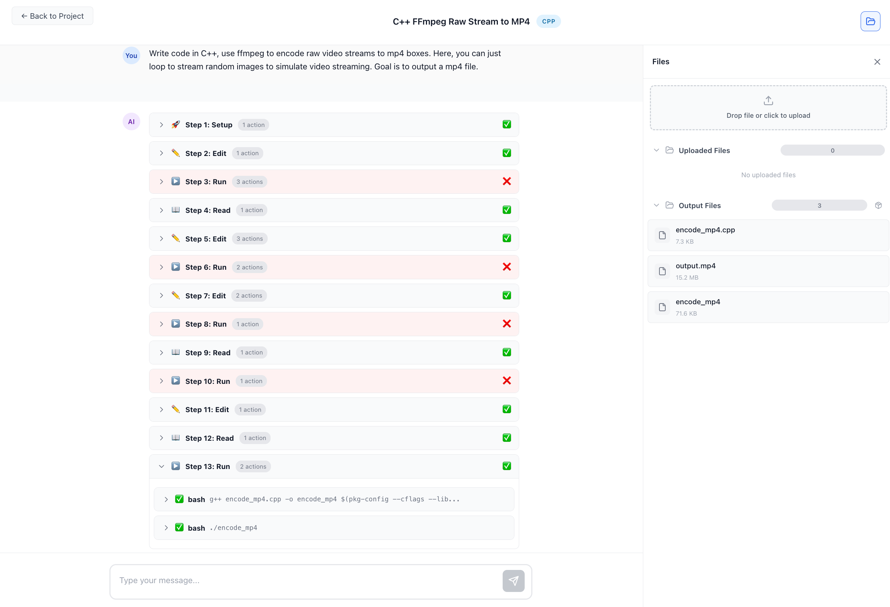

<div align="center">


**Run your code like a breeze** - Self-hosted AI assistant with web interface, integrated autonomous agents and sandboxed execution

[](https://www.python.org/)
[](https://nodejs.org/)
[](https://www.docker.com/)
[](LICENSE)

[Features](#features) · [Quick Start](#quick-start) · [Documentation](#documentation) · [Contributing](#contributing)

</div>

---

## What is BreezeRun?

BreezeRun is a self-hosted alternative to cloud-based AI coding assistants. It provides a web interface for interacting with autonomous AI agents that can write, execute, and debug code in isolated Docker containers.

**Key benefits:**
- **Privacy** - Your code stays on your infrastructure
- **Choice** - Use any LLM provider (Ollama, OpenAI, Anthropic, Google, or 100+ others via LiteLLM)
- **Control** - Configure agents, tools, and execution environments per project
- **Safety** - All code execution happens in sandboxed Docker containers

## Feature Highlights

### Secure Multi-Provider API Key Management
Store API keys for 10+ LLM providers securely with AES-128 encryption. Keys are never displayed after saving and only decrypted when making API calls.


### Flexible Project Management
Organize your work into projects with multiple chat sessions. Configure LLM providers and models per project, upload files, and manage agent settings.


### Real-Time Code Execution
Ask the agent to generate code and see results instantly. The agent sets up the environment, writes code, executes it, and displays output - all in one seamless flow.


### Multi-Step Agent Workflows
Watch AI agents break down complex tasks into logical steps - setup, edit, run, and read - with full visibility into each action. Download generated files directly from the UI, just like claude.ai.


### Complex Task Handling with Error Recovery
Agents tackle challenging tasks like video encoding with FFmpeg, automatically recovering from errors and iterating until success. 



## Quick Start

The easiest way to get started is using our start scripts that automatically install all dependencies and start the services:

**macOS / Linux:**
```bash
git clone https://github.com/zysoong/breezerun.git
cd breezerun
chmod +x start.sh
./start.sh
```

**Windows (PowerShell):**
```powershell
git clone https://github.com/zysoong/breezerun.git
cd breezerun
powershell -ExecutionPolicy Bypass -File start.ps1
```

The start script will:
- **macOS/Linux:** Install Python, Node.js, Poetry, and Docker (if not present)
- **Windows:** Download embedded Python and Node.js to `local_venv/` folder (no system PATH modification, no admin required for Python/Node.js), and install Docker Desktop if not present
- Install all backend and frontend dependencies
- Create `.env` file with auto-generated encryption key
- Build Docker sandbox images (use `-SkipDocker` to skip)
- Start both backend and frontend servers

> **Note (Windows):** Docker Desktop must be started manually after installation. The script will install it but cannot start it automatically.

Then open http://localhost:5173 in your browser.

**Setup only (without starting services):**
```bash
# macOS / Linux
./start.sh --no-start

# Windows
powershell -ExecutionPolicy Bypass -File start.ps1 -NoStart
```

Then start the servers manually:
```bash
# macOS / Linux
# Terminal 1: Start backend
cd backend
poetry run python -m app.main

# Terminal 2: Start frontend
cd frontend
npm run dev
```

```powershell
# Windows - use the embedded runtimes
# Terminal 1: Start backend
cd backend
..\local_venv\python\Scripts\poetry.exe run python -m app.main

# Terminal 2: Start frontend
cd frontend
..\local_venv\node\npm.cmd run dev
```

## Features

### Autonomous Agents

ReAct-based agents that reason through problems step by step:

- **Multi-step execution** - Agents plan, execute, observe, and iterate
- **Tool use** - File operations, bash commands, code search, and more
- **Streaming output** - Watch the agent think and act in real-time
- **Configurable limits** - Control iteration count, timeouts, and resource usage

### Sandboxed Execution

Secure Docker containers for code execution:

- **13 language environments** - Python (3.11-3.13), Node.js (20, 22), Java 21, Go 1.23, Rust 1.83, C++, Ruby 3.3, PHP 8.3, .NET 8, Kotlin, Scala
- **Container pooling** - Pre-warmed containers for fast startup
- **Resource limits** - CPU, memory, and disk quotas
- **File isolation** - Workspace separation between projects

### Agent Tools

| Tool | Description |
|------|-------------|
| `bash` | Execute shell commands with timeout |
| `file_read` | Read files with line numbers, detect binary/images |
| `file_write` | Create files in workspace |
| `edit_lines` | Line-based editing with auto-indent and syntax validation |
| `search` | Code search with ast-grep or regex |
| `think` | Structured reasoning for complex decisions |

### Real-time Interface

Modern React frontend with optimized streaming:

- **30ms batched updates** - Smooth streaming like ChatGPT
- **Virtual scrolling** - Handle thousands of messages
- **Tool visualization** - Collapsible steps showing agent actions
- **Rich content** - Markdown, syntax highlighting, images

### Multi-Provider LLM Support

Use any LLM via LiteLLM:

- OpenAI
- Anthropic
- Google Gemini
- Ollama
- Groq, Together, and 100+ more

## Manual Installation

If you prefer manual setup instead of using the setup scripts:

### Prerequisites

- Python 3.12+
- Node.js 18+
- Docker 20.10+ (optional, for sandboxed execution)
- An LLM API key (OpenAI, Anthropic, etc.)

### Steps

```bash
# Clone the repository
git clone https://github.com/zysoong/breezerun.git
cd breezerun

# Backend setup
cd backend
pip install poetry
poetry install

# Create .env file
cp .env.example .env
# Edit .env and add your MASTER_ENCRYPTION_KEY (or let the app auto-generate one)

# Start backend
poetry run python -m app.main

# Frontend setup (new terminal)
cd frontend
npm install
npm run dev

# Open http://localhost:5173
```

### Using Docker Compose

```bash
docker-compose up -d
# Open http://localhost:3000
```

## Architecture

```
┌─────────────────────────────────────────────────────────────┐
│                        Frontend                              │
│  React + TypeScript + Vite                                  │
│  - Real-time streaming via WebSocket                        │
│  - Virtual scrolling with React-Virtuoso                    │
│  - Tool visualization with collapsible steps                │
└────────────────────────┬────────────────────────────────────┘
                         │
                         ▼
┌─────────────────────────────────────────────────────────────┐
│                        Backend                               │
│  FastAPI + SQLAlchemy + LiteLLM                             │
│  - ReAct agent with tool execution                          │
│  - WebSocket streaming                                       │
│  - REST API for projects, sessions, files                   │
└────────────────────────┬────────────────────────────────────┘
                         │
          ┌──────────────┼──────────────┐
          ▼              ▼              ▼
     ┌─────────┐   ┌─────────┐   ┌─────────┐
     │ LiteLLM │   │ SQLite  │   │ Docker  │
     │ (LLMs)  │   │  (DB)   │   │(Sandbox)│
     └─────────┘   └─────────┘   └─────────┘
```

## Documentation

| Resource | Description |
|----------|-------------|
| [Frontend README](frontend/README.md) | React app setup and components |
| [Backend README](backend/README.md) | API server, agent system, tools |
| [API Docs](http://localhost:8000/docs) | Interactive Swagger documentation |

## Agent Templates

Pre-configured agents for common tasks:

| Template | Use Case |
|----------|----------|
| `python_dev` | Python 3.13 development with pytest |
| `node_dev` | TypeScript/JavaScript development |
| `data_analyst` | Data analysis with pandas, matplotlib |
| `code_reviewer` | Read-only code review |
| `test_writer` | Test generation |
| `default` | General purpose (Coding tasks preferred) |

## Example Usage

1. **Create a project** - Click "New Project" and give it a name
2. **Start a chat** - Open the project and create a new chat session
3. **Ask the agent** - Examples:
   - "Create a Flask API with user authentication"
   - "Analyze this CSV and create visualizations"
   - "Write tests for the utils module"
   - "Debug why the login function fails"

The agent will:
- Set up the environment (Python, Node.js, etc.)
- Write and execute code in the sandbox
- Show you results and iterate based on errors
- Present the final output

## Contributing

Contributions are welcome! Please see [CONTRIBUTING.md](CONTRIBUTING.md) for guidelines.

## Related Projects

BreezeRun is inspired by:

- [OpenHands](https://github.com/All-Hands-AI/OpenHands) - Open-source AI software engineers
- [Aider](https://aider.chat) - AI pair programming in terminal
- [Continue](https://continue.dev) - AI code assistant for IDEs

## License

MIT License - see [LICENSE](LICENSE) for details.

---

<div align="center">

**[Get Started](#quick-start)** · **[Report Bug](https://github.com/zysoong/breezerun/issues)** · **[Request Feature](https://github.com/zysoong/breezerun/issues)**

</div>
